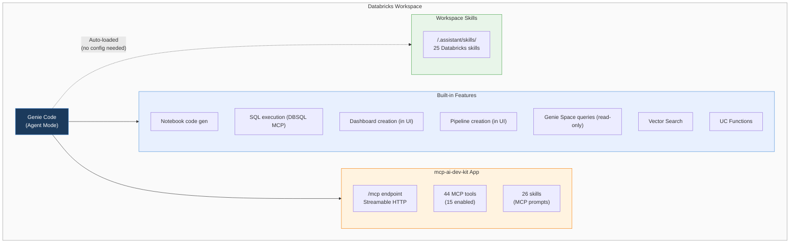

# Genie Code + AI Dev Kit MCP Setup Guide

> **[한국어 버전 (Korean)](docs/README_ko.md)**

## Quick Start (3 min)

```bash
# 1. Clone the repo
git clone https://github.com/SimyungYang/genie-code-ai-dev-kit.git
cd genie-code-ai-dev-kit

# 2. Deploy (creates app + deploys + grants permissions + uploads skills)
#    --catalog is required. Specify your Unity Catalog name.
./deploy.sh --catalog my_catalog

# Options: specify profile / app name
./deploy.sh --catalog my_catalog --profile my_profile --app-name my-mcp-app
```

> **Windows users**: `deploy.sh` is a Bash script. Use Git Bash, WSL, or follow the [manual setup guide](#3-step-by-step-setup-guide) below.

After deployment:
1. Open a Databricks notebook
2. Genie Code → Settings → MCP Servers → "+ Add Server" → select `mcp-ai-dev-kit`
3. Enable only the tools you need (recommended: 15)

### Uninstall

```bash
# Default app name
./uninstall.sh

# Specify app name / profile
./uninstall.sh --app-name mcp-simyung --profile my_profile
```

Removes the app, workspace source code, and skills in one step. After uninstalling, manually remove the server from Genie Code Settings → MCP Servers.

> For detailed manual setup, see [Step-by-Step Setup Guide](#3-step-by-step-setup-guide) below.

---

## Prerequisites

### Required

| Item | Requirement | How to verify |
|------|------------|---------------|
| **Databricks Workspace** | Premium or above, Unity Catalog enabled | Access workspace URL |
| **Databricks CLI** | v0.230+ | `databricks --version` |
| **CLI Authentication** | OAuth or PAT configured | `databricks current-user me` |
| **Python** | 3.10+ | `python3 --version` (Windows: `python --version`) |
| **Git** | Latest version | `git --version` |
| **jq** | JSON parser (used by deploy.sh) | `jq --version` |

### Installing Databricks CLI

<details>
<summary><b>macOS</b></summary>

```bash
brew install databricks
databricks --version
```
</details>

<details>
<summary><b>Windows</b></summary>

```powershell
# Option 1: winget (recommended)
winget install Databricks.DatabricksCLI

# Option 2: Chocolatey
choco install databricks-cli

# Option 3: Direct download
# Download Windows AMD64 zip from https://github.com/databricks/cli/releases
# Extract and copy databricks.exe to a directory in your PATH

databricks --version
```

> **Note**: `pip install databricks-cli` installs the **legacy CLI**. Always use the methods above for the latest Databricks CLI.
</details>

<details>
<summary><b>Linux</b></summary>

```bash
curl -fsSL https://raw.githubusercontent.com/databricks/setup-cli/main/install.sh | sh
databricks --version
```
</details>

### Databricks CLI Authentication

```bash
# OAuth login (recommended — opens browser for login)
databricks auth login --host https://<your-workspace-url>

# Verify
databricks current-user me
```

> For multiple profiles, use `--profile <name>`.
> Example: `databricks auth login --host https://adb-xxxx.azuredatabricks.net --profile workshop`

### Workspace Permissions

| Permission | Why needed | How to verify |
|-----------|-----------|---------------|
| **Create Databricks Apps** | Deploy MCP app | Workspace Settings → Apps enabled |
| **Serverless Compute** | App runtime | Contact admin |
| **Unity Catalog owner** or **admin** | Grant privileges to SP | `SHOW GRANTS ON CATALOG <name>` |
| **SQL Warehouse access** | MCP tools execute SQL | Check SQL Warehouses |

### Installing jq (required by deploy.sh)

<details>
<summary><b>macOS</b></summary>

```bash
brew install jq
```
</details>

<details>
<summary><b>Windows</b></summary>

```powershell
winget install jqlang.jq
# or: choco install jq
# or: scoop install jq
```
</details>

<details>
<summary><b>Linux</b></summary>

```bash
# Ubuntu/Debian
sudo apt-get install jq

# RHEL/CentOS
sudo yum install jq
```
</details>

### Running deploy.sh on Windows

`deploy.sh` is a Bash script. On Windows, use one of the following:

| Method | Description | Command |
|--------|------------|---------|
| **Git Bash** (recommended) | Included with Git for Windows | `./deploy.sh --catalog my_catalog` |
| **WSL** | Windows Subsystem for Linux | Same command in WSL terminal |
| **Manual setup** | Without Bash | See [Step-by-Step Setup Guide](#3-step-by-step-setup-guide) |

> **Git Bash note**: `python3` may not be available. If `python --version` shows Python 3.10+, deploy.sh will auto-detect it.

---

## Why This Setup?

Genie Code is a powerful AI assistant built on state-of-the-art LLMs. It generates code in notebooks, creates charts in the dashboard UI, and writes ETL pipelines in the Pipeline Editor — it already works great **within each product area**.

However, real-world data engineering often requires requests like:

> "Create a Genie Space from these tables"  
> "Build a dashboard from this analysis and schedule a daily refresh job"  
> "Create a Knowledge Assistant and connect it to a Supervisor Agent"

Genie Code alone cannot handle these. It can *query* a Genie Space but cannot *create* one. It can build dashboards only from the dashboard UI — not from a single notebook conversation that also sets up a Job. Features like Supervisor Agents, Knowledge Assistants, Apps deployment, Lakebase, and Model Serving are not available in Genie Code at all.

[Databricks AI Dev Kit](https://github.com/databricks-solutions/ai-dev-kit) fills these gaps with 44+ MCP tools and 25 Skills. By deploying the AI Dev Kit MCP server as a Databricks App and connecting it to Genie Code, you can perform cross-product orchestration in a single conversation.

Genie Code has an **MCP tool limit** (max 15 per server, max 20 across all servers). Since you cannot enable all 44 tools, we recommend leaving features that Genie Code already handles well (SQL execution, Genie queries) to the built-in capabilities, and **enabling only the tools that Genie Code lacks**.

> **Note**: The latest pip version of AI Dev Kit consolidates CRUD operations into `manage_*` patterns, providing 44 tools. (The older vibe agent plugin had 77 individual functions.)

This repo provides a step-by-step guide for the entire setup process.

---

## Table of Contents

1. [Genie Code vs AI Dev Kit — What's Different?](#1-genie-code-vs-ai-dev-kit--whats-different)
2. [Architecture](#2-architecture)
3. [Step-by-Step Setup Guide](#3-step-by-step-setup-guide)
4. [Recommended MCP Tool Selection](#4-recommended-mcp-tool-selection)
5. [Test Scenarios](#5-test-scenarios)
6. [Troubleshooting](#6-troubleshooting)
7. [References](#7-references)

---

## 1. Genie Code vs AI Dev Kit — What's Different?

### Genie Code Agent Mode Built-in Capabilities

Genie Code Agent Mode already performs various tasks **within each product UI**:

| Product Area | Built-in Feature | How it works |
|-------------|-----------------|--------------|
| Notebooks | EDA, model training, code gen/edit/debug | Cell-level execution within notebooks |
| AI/BI Dashboards | **Dashboard creation**, data analysis | Widget/query creation in dashboard UI |
| Lakeflow Pipelines | **Spark Declarative Pipeline creation** | Code generation in Pipeline Editor |
| SQL Editor | SQL generation, optimization, execution | Within SQL Editor |
| MLflow | GenAI app debugging, trace analysis | MLflow UI integration |
| Jobs | Code editing, error diagnosis | From Jobs page |

**Managed MCP (available out-of-the-box):**

| MCP Server | Feature |
|-----------|---------|
| DBSQL | Natural language → SQL execution |
| Genie Space | Genie Space queries (read-only) |
| Vector Search | Vector search |
| UC Functions | Unity Catalog function execution |

### Genie Code's Limitations — Solved by AI Dev Kit

The core constraint of Genie Code is that it **only operates within a single product area**.

> **Key comparison:**
> - **Genie Code** = "Single product area" — code/analysis within one product
> - **AI Dev Kit** = "Across products" — orchestrate pipelines + dashboards + jobs in one conversation

### Features Completely Missing from Genie Code (AI Dev Kit exclusive)

| Feature | AI Dev Kit Tool | Description |
|---------|----------------|-------------|
| **Genie Space creation/management** | `manage_genie` | Create, edit, connect tables, migrate |
| **Supervisor Agent (MAS)** | `manage_mas` | Create/manage Multi-Agent Supervisors |
| **Knowledge Assistant (KA)** | `manage_ka` | Create/manage document-based QA agents |
| **Apps deployment** | `manage_app` | Create/deploy/manage Databricks Apps |
| **Lakebase** | `manage_lakebase_database` | Create/manage PostgreSQL-compatible DBs |
| **Model Serving** | `manage_serving_endpoint` | Deploy/manage serving endpoints |
| **UC permission management** | `manage_uc_grants` | GRANT/REVOKE permissions |
| **UC object management** | `manage_uc_objects` | Catalog/schema/table CRUD |
| **Vector Search index creation** | `manage_vs_index` | Create indexes/endpoints (OOB only searches) |
| **Workspace file management** | `manage_workspace_files` | Upload/download/manage files |
| **Remote code execution** | `execute_code` | Run Python/Scala on clusters |

### Features Genie Code Has in UI but Cannot Do Cross-Product

| Feature | Genie Code (within UI) | AI Dev Kit MCP (cross-product) |
|---------|----------------------|-------------------------------|
| Dashboard creation | Available in dashboard UI | Create from **anywhere** via API |
| Pipeline creation | Available in Pipeline Editor | Create from **anywhere** via API |
| Job creation | Code editing in Jobs page | Full job **definition/schedule/execution** |

### Cross-Product Orchestration — Only with AI Dev Kit

When you ask Genie Code to "create a dashboard from this notebook," you have to switch to the dashboard UI.
With AI Dev Kit MCP connected, you can execute the entire workflow **in a single conversation**:

> "Create a Genie Space from gold schema tables → build a dashboard → set up a daily refresh job"

---

## 2. Architecture



**Genie Code is extended through two paths:**

1. **Skills (automatic)**: Deploy to `/Workspace/.assistant/skills/` → Genie Code auto-loads them contextually (no configuration needed)
2. **MCP Tools (manual)**: Deploy `mcp-ai-dev-kit` Databricks App → Add server in Genie Code Settings

---

## 3. Step-by-Step Setup Guide

### Prerequisites

- [Databricks CLI](https://docs.databricks.com/dev-tools/cli/install.html) installed
- Workspace admin or app creation permissions
- `jq` installed (`brew install jq` or `apt install jq`)

### Step 1: Authenticate Databricks CLI

```bash
databricks auth login --host https://<your-workspace-url>

# Verify
databricks current-user me
```

### Step 2: Clone This Repo

```bash
git clone https://github.com/SimyungYang/genie-code-ai-dev-kit.git
cd genie-code-ai-dev-kit
```

### Step 3: Create the App

> **Important**: The app name **must** start with `mcp-` for Genie Code to recognize it.

```bash
databricks apps create mcp-ai-dev-kit \
  --description "AI Dev Kit MCP Server for Genie Code"
```

### Step 4: Upload Source Code and Deploy

```bash
DBUSER=$(databricks current-user me | jq -r .userName)
APP_PATH="/Workspace/Users/$DBUSER/mcp-ai-dev-kit-app"

# Upload
databricks workspace mkdirs "$APP_PATH"
for f in app/main.py app/app.yaml app/requirements.txt; do
  databricks workspace import "$APP_PATH/$(basename $f)" \
    --file "$f" --format RAW --overwrite
done

# Deploy
databricks apps deploy mcp-ai-dev-kit --source-code-path "$APP_PATH"

# Check status (wait for state: SUCCEEDED)
databricks apps get mcp-ai-dev-kit
```

Deployment takes 2-3 minutes. Proceed to the next step once `state: SUCCEEDED` is confirmed.

### Step 5: Grant Permissions to the App Service Principal

A service principal (SP) is automatically assigned when the app is created.

```bash
# Get SP info
SP_CLIENT_ID=$(databricks apps get mcp-ai-dev-kit -o json | jq -r .service_principal_client_id)
SP_ID=$(databricks apps get mcp-ai-dev-kit -o json | jq -r .service_principal_id)
echo "SP Client ID: $SP_CLIENT_ID"
echo "SP ID: $SP_ID"
```

#### 5-1. Grant Entitlements

```bash
databricks api patch /api/2.0/preview/scim/v2/ServicePrincipals/$SP_ID --json '{
  "schemas": ["urn:ietf:params:scim:api:messages:2.0:PatchOp"],
  "Operations": [{"op": "add", "value": {
    "entitlements": [
      {"value": "allow-cluster-create"},
      {"value": "workspace-access"},
      {"value": "databricks-sql-access"}
    ]
  }}]
}'
```

#### 5-2. Grant Catalog Privileges (run in SQL Warehouse)

```sql
-- Replace <sp_client_id> with the SP Client ID from above
GRANT ALL PRIVILEGES ON CATALOG <your_catalog> TO `<sp_client_id>`;
```

#### 5-3. SQL Warehouse Access

```bash
WH_ID="<your_warehouse_id>"
TOKEN=$(databricks auth token | jq -r .access_token)
HOST=$(databricks auth env | jq -r .env.DATABRICKS_HOST)

curl -X PATCH "$HOST/api/2.0/permissions/warehouses/$WH_ID" \
  -H "Authorization: Bearer $TOKEN" \
  -H "Content-Type: application/json" \
  -d "{\"access_control_list\": [{
    \"service_principal_name\": \"$SP_CLIENT_ID\",
    \"permission_level\": \"CAN_USE\"
  }]}"
```

#### 5-4. Genie Space Access (per Space)

```bash
SPACE_ID="<genie_space_id>"
curl -X PATCH "$HOST/api/2.0/permissions/genie/$SPACE_ID" \
  -H "Authorization: Bearer $TOKEN" \
  -H "Content-Type: application/json" \
  -d "{\"access_control_list\": [{
    \"service_principal_name\": \"$SP_CLIENT_ID\",
    \"permission_level\": \"CAN_RUN\"
  }]}"
```

> **Tip**: In test environments, adding the SP to the admins group grants all permissions at once.

### Step 6: Deploy Skills to Workspace

The app auto-uploads skills on startup, but if SP permissions are insufficient, deploy manually:

```bash
# Clone AI Dev Kit
git clone --depth 1 https://github.com/databricks-solutions/ai-dev-kit.git /tmp/ai-dev-kit

# Bulk upload skills
TARGET="/Workspace/.assistant/skills"
for skill_dir in /tmp/ai-dev-kit/databricks-skills/*/; do
  skill_name=$(basename "$skill_dir")
  [ "$skill_name" = "TEMPLATE" ] && continue

  databricks workspace mkdirs "$TARGET/$skill_name"
  for f in "$skill_dir"*; do
    [ -f "$f" ] || continue
    databricks workspace import "$TARGET/$skill_name/$(basename $f)" \
      --file "$f" --format RAW --overwrite
  done
  echo "Done: $skill_name"
done

# Verify
databricks workspace list /Workspace/.assistant/skills/
```

Skills are **contextually auto-loaded** in Genie Code Agent Mode. No additional configuration needed.


### Step 7: Connect MCP Server in Genie Code

1. Open Databricks Workspace
2. Click the **Genie Code icon** in the top right
3. Confirm **Agent** mode is selected (bottom right)
4. Click **Settings** (gear icon)
5. **MCP Servers** → **+ Add Server**
6. Select **`mcp-ai-dev-kit`** from the **Custom MCP Server** dropdown
7. **Save**


### Step 8: Enable MCP Tools

After adding the server, a "15 tool limit exceeded" warning will appear.

1. Click the `mcp-ai-dev-kit` entry in Settings
2. Toggle ON only the 15 tools you need (see next section)
3. **Close** → Confirm the main toggle is **ON**


---

## 4. Recommended MCP Tool Selection

With the 15-tool limit, **avoid overlap with Genie Code OOB and focus on AI Dev Kit-exclusive features**.
Different roles need different tools. See the role-based profiles below.

### Role-Based Profiles

#### Profile A: Data Engineer (Pipelines + Jobs)

> Pipeline configuration, job scheduling, data quality management

| # | Tool | Purpose |
|---|------|---------|
| 1 | `manage_pipeline` | Create/modify/delete DLT pipelines |
| 2 | `manage_pipeline_run` | Start/stop pipeline runs |
| 3 | `manage_jobs` | Define/schedule jobs |
| 4 | `manage_job_runs` | Run/monitor/cancel jobs |
| 5 | `execute_code` | Run PySpark code directly on clusters |
| 6 | `execute_sql` | Execute DDL/DML directly (no notebook detour) |
| 7 | `manage_uc_objects` | Manage catalogs/schemas/tables/volumes |
| 8 | `manage_uc_grants` | Grant table/schema permissions |
| 9 | `get_table_stats_and_schema` | Check table schema/statistics |
| 10 | `manage_dashboard` | Create pipeline monitoring dashboards |
| 11 | `manage_workspace_files` | Manage notebooks/files |
| 12 | `manage_cluster` | Create/start/terminate clusters |
| 13 | `manage_sql_warehouse` | Manage SQL Warehouses |
| 14 | `manage_genie` | Create Genie Spaces for data exploration |
| 15 | `list_compute` | List available compute resources |

#### Profile B: AI/ML Engineer (Agent Bricks + Serving)

> Supervisor Agents, Knowledge Assistants, Model Serving

| # | Tool | Purpose |
|---|------|---------|
| 1 | `manage_mas` | Create/manage Supervisor Agents |
| 2 | `manage_ka` | Create/manage Knowledge Assistants |
| 3 | `manage_genie` | Create Genie Spaces (as MAS sub-agents) |
| 4 | `manage_serving_endpoint` | Deploy/manage Model Serving endpoints |
| 5 | `manage_vs_index` | Create Vector Search indexes |
| 6 | `manage_vs_endpoint` | Manage Vector Search endpoints |
| 7 | `manage_vs_data` | Sync Vector Search data |
| 8 | `execute_code` | Run model training/evaluation code |
| 9 | `manage_uc_objects` | Manage UC objects |
| 10 | `manage_uc_grants` | Manage endpoint/table permissions |
| 11 | `manage_app` | Deploy agent apps |
| 12 | `manage_jobs` | Schedule training/evaluation jobs |
| 13 | `manage_job_runs` | Run/monitor jobs |
| 14 | `manage_workspace_files` | Manage model artifacts/notebooks |
| 15 | `manage_lakebase_database` | Lakebase for agent state storage |

#### Profile C: Data Analyst / BI (Dashboards + Genie)

> Data exploration, dashboard creation, Genie Space usage

| # | Tool | Purpose |
|---|------|---------|
| 1 | `manage_dashboard` | Create/modify/publish dashboards |
| 2 | `manage_genie` | Create Genie Spaces / add tables |
| 3 | `execute_sql` | Execute SQL directly (including DDL) |
| 4 | `execute_sql_multi` | Execute multiple SQL statements |
| 5 | `get_table_stats_and_schema` | Check table schema/stats/samples |
| 6 | `manage_uc_objects` | Browse catalogs/schemas/tables |
| 7 | `manage_jobs` | Set up dashboard refresh jobs |
| 8 | `manage_job_runs` | Verify job executions |
| 9 | `manage_uc_grants` | Grant team members table access |
| 10 | `manage_workspace_files` | Manage query/notebook files |
| 11 | `execute_code` | Run data preprocessing code |
| 12 | `manage_ka` | Create document-based QA agents |
| 13 | `manage_mas` | Create analysis Supervisor Agents |
| 14 | `manage_sql_warehouse` | Manage warehouses |
| 15 | `list_compute` | List available compute |

#### Profile D: Platform Admin (Infrastructure + Permissions)

> UC permission management, compute management, app deployment

| # | Tool | Purpose |
|---|------|---------|
| 1 | `manage_uc_objects` | Catalog/schema/volume CRUD |
| 2 | `manage_uc_grants` | GRANT/REVOKE permissions |
| 3 | `manage_uc_storage` | External storage management |
| 4 | `manage_uc_connections` | External connection management |
| 5 | `manage_uc_tags` | Tag management |
| 6 | `manage_uc_security_policies` | Security policy management |
| 7 | `manage_cluster` | Create/manage/terminate clusters |
| 8 | `manage_sql_warehouse` | SQL Warehouse management |
| 9 | `manage_app` | Deploy/manage Databricks Apps |
| 10 | `manage_lakebase_database` | Manage Lakebase instances |
| 11 | `manage_serving_endpoint` | Manage serving endpoints |
| 12 | `manage_jobs` | Manage/clean up jobs |
| 13 | `manage_workspace_files` | Manage workspace files |
| 14 | `execute_sql` | Run administrative SQL |
| 15 | `list_compute` | View compute resource status |

#### Profile E: All-Round (Broadest Coverage)

> General-purpose — covers diverse tasks without specializing

| # | Tool | Purpose |
|---|------|---------|
| 1 | `manage_genie` | Genie Space creation/management |
| 2 | `manage_mas` | Supervisor Agent |
| 3 | `manage_ka` | Knowledge Assistant |
| 4 | `manage_dashboard` | Dashboard creation |
| 5 | `manage_jobs` | Job management |
| 6 | `manage_job_runs` | Job execution |
| 7 | `manage_pipeline` | Pipeline management |
| 8 | `manage_pipeline_run` | Pipeline execution |
| 9 | `manage_app` | Apps deployment |
| 10 | `manage_lakebase_database` | Lakebase |
| 11 | `manage_serving_endpoint` | Model Serving |
| 12 | `execute_code` | Code execution |
| 13 | `manage_uc_objects` | UC management |
| 14 | `manage_uc_grants` | Permission management |
| 15 | `manage_workspace_files` | File management |

### Tools to Disable (Overlap with OOB)

Disable tools that Genie Code already handles via built-in MCP to save tool slots:

| Tool | Reason |
|------|--------|
| `ask_genie` | Already handled by Genie Code's OOB Genie Space MCP |
| `query_vs_index` | Already handled by Genie Code's OOB Vector Search MCP |

> `execute_sql` overlaps with OOB DBSQL, but Genie Code sometimes falls back to creating a notebook instead. Enabling it is recommended depending on your profile.

---

## 5. Test Scenarios

### Verify Skills Auto-Loading

Enter in Genie Code:
```
How do I set up a medallion architecture with Spark Declarative Pipelines?
```
→ The `databricks-spark-declarative-pipelines` skill auto-loads with best practices-based response


### MCP Tool: Create a Genie Space (not available OOB)

```
Create a new Genie Space from the regional_kpis and customer_360_v2 tables in the gold schema
```
→ Calls `manage_genie`

### MCP Tool: Cross-Product Dashboard Creation

```
Create a regional revenue trend dashboard from the regional_kpis table.
Catalog: my_catalog, Schema: gold.
```
→ Calls `manage_dashboard`

### MCP Tool: Job Scheduling

```
Create a job that refreshes gold tables daily at 9 AM KST
```
→ Calls `manage_jobs`

### End-to-End Scenario (Cross-Product Orchestration)

```
1. Create a Genie Space from gold schema tables
2. Build a revenue trend dashboard with the same data
3. Set up a daily data refresh job
```
→ Calls `manage_genie` → `manage_dashboard` → `manage_jobs` sequentially

---

## 6. Tips & Tricks

### Not Sure Which Tools to Enable? Ask Genie Code

Before starting a specific task, ask Genie Code which tools you need:

```
Which MCP tools should I enable to create an SDP pipeline?
```

Genie Code compares currently enabled tools and suggests additional ones, categorized as **required vs. helpful**. Use this to identify the optimal tool combination before starting work.


**Examples:**

| Task | Prompt |
|------|--------|
| Dashboard creation | "Which MCP tools do I need to create a dashboard?" |
| RAG pipeline | "What MCP tools are needed for Vector Search RAG?" |
| Agent setup | "Which tools do I need to create a Supervisor Agent?" |
| Data generation | "How do I generate synthetic data and save it to a Delta table?" |

### "Failed to call ..." Error

Genie Code may fail an MCP tool call and fall back to code execution.

**Cause**: App cold start (retry after 10-30 seconds)

**Solution**: Say "Try again with the MCP tool." Even if Genie Code suggests using a notebook instead, retrying with MCP is usually more efficient.

### Tool-to-Task Mapping

If an MCP tool call fails, check whether the required tool is enabled:

| Task | Required Tools | Supporting Tools |
|------|---------------|-----------------|
| **Generate data → Save to Delta** | `execute_sql` | `execute_code`, `manage_uc_objects` |
| **Create SDP pipeline** | `manage_pipeline`, `manage_workspace_files` | `execute_sql`, `manage_pipeline_run` |
| **Create dashboard** | `manage_dashboard` | `execute_sql`, `get_table_stats_and_schema` |
| **Schedule a job** | `manage_jobs` | `manage_job_runs` |
| **Set up Genie Space** | `manage_genie` | `execute_sql`, `manage_uc_objects` |
| **Agent Bricks (MAS/KA)** | `manage_mas`, `manage_ka` | `manage_genie`, `manage_serving_endpoint` |
| **RAG pipeline** | `manage_vs_index`, `manage_vs_endpoint` | `execute_code`, `manage_serving_endpoint` |
| **Deploy an app** | `manage_app` | `manage_workspace_files` |
| **UC management** | `manage_uc_objects`, `manage_uc_grants` | `execute_sql` |
| **Lakebase setup** | `manage_lakebase_database` | `manage_lakebase_branch` |

### Warm-Up: Wake the App Before Use

The MCP app may cold start from an idle state, causing the first call to fail. Send a simple request to wake it up:

```
Show me the current user info
```

---

## 7. Troubleshooting

### MCP Server Not Showing in Dropdown
- Verify app name **starts with `mcp-`** (required)
- Confirm app is deployed in the **same workspace**
- Check app status: `databricks apps get mcp-ai-dev-kit`

### "Could not enable server" / "exceeds the limit of 15 tools"
- Cannot enable all 44 tools → manually select 15
- Also watch the total **20-tool limit across all MCP servers**


### "Failed to fetch" Error
- **Cause**: App cold start or transient network timeout
- **Quick fix**: Retry the same request (wait 10-30 seconds)
- **Prevention**: Send a warm-up request before starting work
- **Persistent**: Remove MCP server in Settings → re-add
- **Redeploy**: `databricks apps deploy mcp-ai-dev-kit --source-code-path "$APP_PATH"`

### Permission Error on Tool Call
- Verify SP permissions from Step 5
- Test environment: Add SP to admins group

### Skills Not Loading
- Verify files exist in `/Workspace/.assistant/skills/`
- Confirm Genie Code is in **Agent mode** (skills not supported in Chat mode)
- Check Settings > Workspace Skills path is `/.assistant/skills`

### "Request timed out" Error
- **Cause**: `execute_code` times out waiting for cluster startup (Apps proxy has a 60s–2min hard limit)
- **Workaround**: Prefer `execute_sql` (Warehouse is typically already running). Use `execute_code` only for PySpark/ML tasks that can't be done via SQL.
- **Prevention**: Pre-start clusters or use serverless compute

### Redeploy (Get Latest AI Dev Kit)
```bash
databricks apps deploy mcp-ai-dev-kit --source-code-path "$APP_PATH"
```
Since `requirements.txt` references the GitHub main branch, redeploying automatically picks up the latest AI Dev Kit.

---

## 8. References

| Resource | URL |
|----------|-----|
| AI Dev Kit GitHub | https://github.com/databricks-solutions/ai-dev-kit |
| Custom MCP Server Docs | https://docs.databricks.com/aws/en/generative-ai/mcp/custom-mcp |
| Genie Code MCP Docs | https://docs.databricks.com/aws/en/genie-code/mcp |
| Skills Specification | https://agentskills.io/specification |

---

## Project Structure

```
.
├── README.md                   # This guide (English)
├── deploy.sh                   # Automated deployment script
├── uninstall.sh                # Uninstall script (app + source + skills)
├── app/                        # MCP server app source (Databricks App)
│   ├── main.py
│   ├── app.yaml
│   └── requirements.txt
├── assistant_instructions.md   # Genie Code User Instructions
├── slides.md                   # MARP presentation slides
├── test-prompts-100.md         # 100 test prompts for Genie Code
└── docs/                       # Screenshots and Korean README
```
