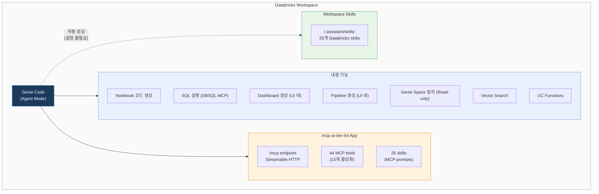
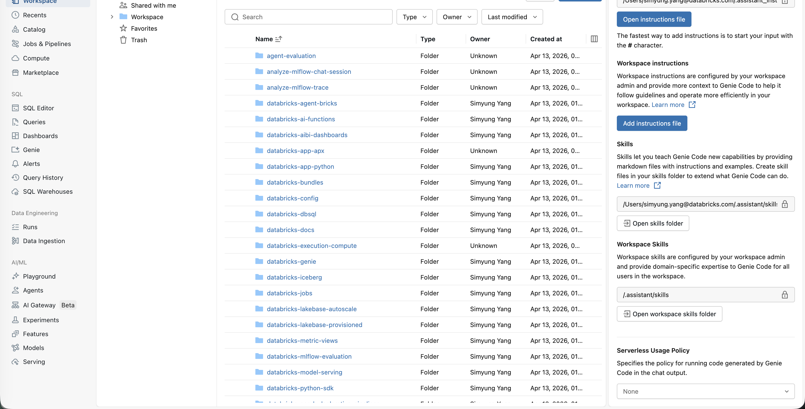
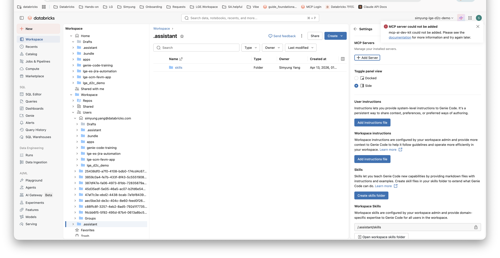
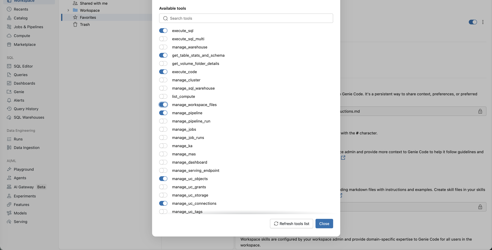
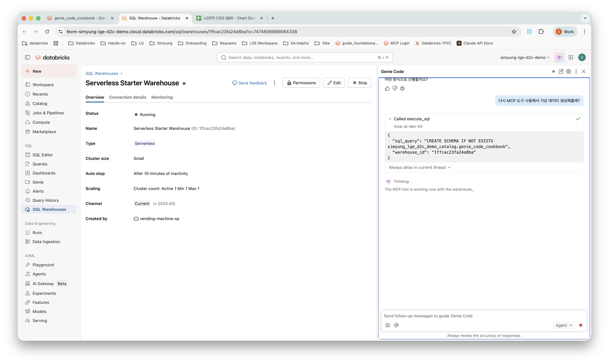
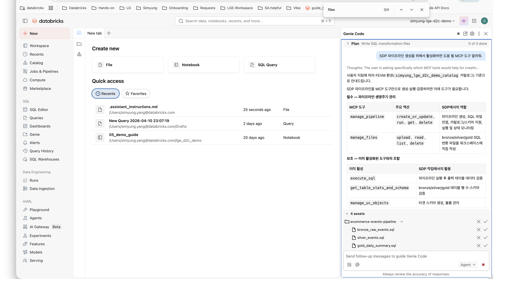
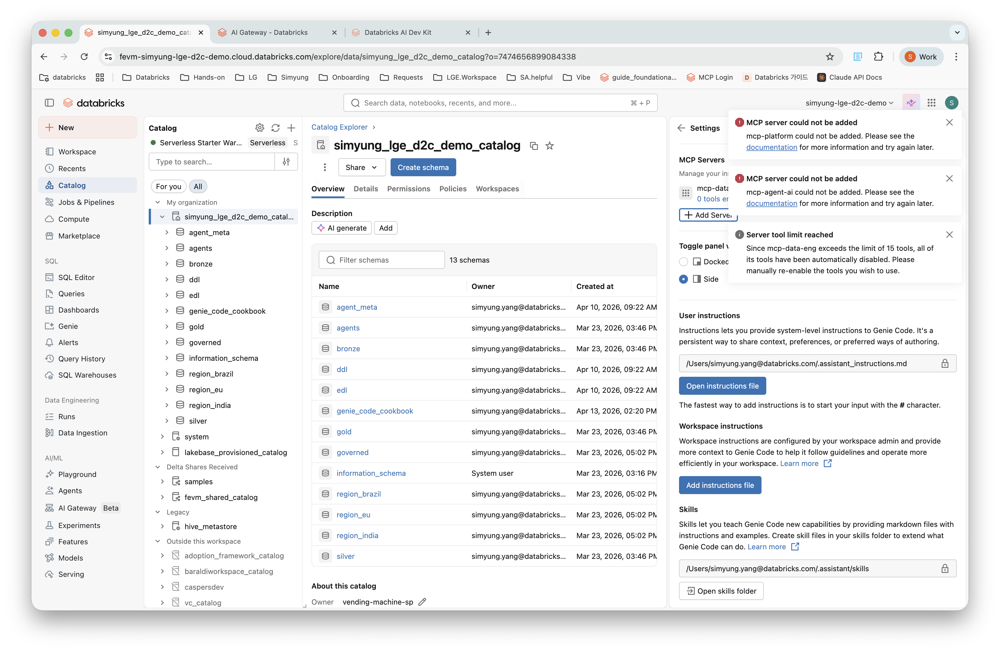

# Genie Code + AI Dev Kit MCP 구성 가이드

## Quick Start — 간편 배포 (3분)

```bash
# 1. 리포 클론
git clone https://github.com/SimyungYang/genie-code-ai-dev-kit.git
cd genie-code-ai-dev-kit

# 2. 간편 배포 (앱 생성 + 배포 + 권한 + Skills 자동)
#    --catalog은 필수입니다. 본인의 Unity Catalog 이름을 지정하세요.
./deploy.sh --catalog my_catalog

# 옵션: 프로필/앱 이름 지정
./deploy.sh --catalog my_catalog --profile my_profile --app-name my-mcp-app
```

> **Windows 사용자**: `deploy.sh`는 Bash 스크립트입니다. Git Bash, WSL, 또는 아래 [수동 설정 가이드](#3-step-by-step-구성-가이드)를 참고하세요.

배포 완료 후:
1. Databricks 노트북 열기
2. Genie Code (✨) → Settings → MCP Servers → "+ Add Server" → `mcp-ai-dev-kit` 선택
3. 필요한 도구만 ON (권장 15개)

> 상세 수동 설정은 아래 [Step-by-Step 구성 가이드](#3-step-by-step-구성-가이드) 참조

---

## 전제조건 (Prerequisites)

### 필수

| 항목 | 요구사항 | 확인 방법 |
|------|---------|----------|
| **Databricks Workspace** | Premium 이상, Unity Catalog 활성화 | 워크스페이스 URL 접속 가능 |
| **Databricks CLI** | v0.230+ | `databricks --version` |
| **CLI 인증** | OAuth 또는 PAT 인증 완료 | `databricks current-user me` |
| **Python** | 3.10+ | `python3 --version` (Windows: `python --version`) |
| **Git** | 최신 버전 | `git --version` |
| **jq** | JSON 파서 (deploy.sh에서 사용) | `jq --version` |

### Databricks CLI 설치

<details>
<summary><b>macOS</b></summary>

```bash
# Homebrew
brew install databricks

# 버전 확인
databricks --version
```
</details>

<details>
<summary><b>Windows</b></summary>

```powershell
# 방법 1: winget (권장)
winget install Databricks.DatabricksCLI

# 방법 2: Chocolatey
choco install databricks-cli

# 방법 3: 직접 다운로드
# https://github.com/databricks/cli/releases 에서 Windows AMD64 zip 다운로드
# 압축 해제 후 databricks.exe를 PATH가 잡힌 디렉토리에 복사

# 버전 확인
databricks --version
```

> **참고**: `pip install databricks-cli`는 **레거시 CLI**입니다. 반드시 위 방법으로 최신 Databricks CLI를 설치하세요.
</details>

<details>
<summary><b>Linux</b></summary>

```bash
# 직접 다운로드
curl -fsSL https://raw.githubusercontent.com/databricks/setup-cli/main/install.sh | sh

# 버전 확인
databricks --version
```
</details>

### Databricks CLI 인증

```bash
# OAuth 인증 (권장 — 브라우저 팝업으로 로그인)
databricks auth login --host https://<워크스페이스-URL>

# 인증 확인
databricks current-user me
```

> 프로필이 여러 개인 경우 `--profile <이름>`으로 지정합니다.
> 예: `databricks auth login --host https://adb-xxxx.azuredatabricks.net --profile workshop`

### Workspace 권한

| 권한 | 필요 이유 | 확인 |
|------|----------|------|
| **Databricks Apps 생성** | MCP 앱 배포 | Workspace Settings → Apps 활성화 |
| **서버리스 컴퓨트** | 앱 실행 환경 | 관리자에게 문의 |
| **Unity Catalog 카탈로그 소유자** 또는 **관리자** | SP에 GRANT 부여 | `SHOW GRANTS ON CATALOG <name>` |
| **SQL Warehouse 접근** | MCP 도구가 SQL 실행 | SQL Warehouses에서 확인 |

### jq 설치 (deploy.sh에서 필요)

<details>
<summary><b>macOS</b></summary>

```bash
brew install jq
```
</details>

<details>
<summary><b>Windows</b></summary>

```powershell
# winget
winget install jqlang.jq

# 또는 Chocolatey
choco install jq

# 또는 scoop
scoop install jq
```
</details>

<details>
<summary><b>Linux</b></summary>

```bash
# Ubuntu/Debian
sudo apt-get install jq

# RHEL/CentOS
sudo yum install jq
```
</details>

### Windows에서 deploy.sh 실행하기

`deploy.sh`는 Bash 스크립트이므로, Windows에서는 다음 중 하나를 사용하세요:

| 방법 | 설명 | 실행 |
|------|------|------|
| **Git Bash** (권장) | Git for Windows 설치 시 포함 | Git Bash 터미널에서 `./deploy.sh --catalog my_catalog` |
| **WSL** | Windows Subsystem for Linux | WSL 터미널에서 동일 명령 |
| **수동 설정** | Bash 없이 진행 | 아래 [Step-by-Step 구성 가이드](#3-step-by-step-구성-가이드) 참조 |

> **Git Bash 사용 시 주의**: `python3` 명령이 없을 수 있습니다. `python --version`으로 Python 3.9+가 확인되면 정상입니다. deploy.sh 내부에서 `python3`를 호출하므로, Git Bash에서는 alias를 설정하거나 WSL을 권장합니다.

---

## 왜 이 구성이 필요한가?

Genie Code는 최신 LLM 모델 기반의 강력한 AI 어시스턴트입니다. 노트북에서 코드를 생성하고, 대시보드 UI에서 차트를 만들고, Pipeline Editor에서 ETL 파이프라인을 작성하는 등 **각 제품 영역 안에서는** 이미 훌륭하게 동작합니다.

하지만 실제 데이터 엔지니어링 업무에서는 이런 요청이 자주 나옵니다:

> "이 테이블들로 Genie Space 하나 만들어줘"  
> "방금 분석한 데이터로 대시보드 만들고, 매일 리프레시 Job까지 걸어줘"  
> "Knowledge Assistant 만들어서 Supervisor Agent에 연결해줘"

Genie Code만으로는 이런 작업을 처리할 수 없습니다. Genie Space 질의는 되지만 **생성**은 안 되고, 대시보드도 대시보드 UI 안에서만 만들 수 있을 뿐 **노트북에서 한 대화로 대시보드 + Job을 동시에** 만드는 건 불가능합니다. Supervisor Agent, Knowledge Assistant, Apps 배포, Lakebase, Model Serving 같은 기능은 아예 Genie Code에 없습니다.

[Databricks AI Dev Kit](https://github.com/databricks-solutions/ai-dev-kit)은 이런 빈 영역을 44개 이상의 MCP 도구와 25개 Skills로 채워줍니다. AI Dev Kit MCP 서버를 Databricks App으로 배포하고 Genie Code에 연결하면, Genie Code가 기존에 할 수 없던 크로스 프로덕트 작업을 하나의 대화에서 수행할 수 있게 됩니다.

다만 Genie Code에는 **MCP 도구 제한**이 있습니다 (서버당 최대 15개, 전체 MCP 서버 합산 최대 20개). AI Dev Kit이 제공하는 44개 도구를 모두 켤 수 없기 때문에, Genie Code가 이미 잘 처리하는 기능(SQL 실행, Genie 질의 등)은 OOB에 맡기고, **Genie Code에 없는 기능 위주로 선택하여 활성화하는 것을 권장합니다.**

> **참고**: AI Dev Kit의 최신 pip 버전은 CRUD 작업을 `manage_*` 패턴으로 통합하여 44개 도구로 제공합니다. (vibe agent 플러그인의 구버전은 개별 함수 77개)

이 레포는 그 전체 과정을 Step-by-Step으로 정리한 가이드입니다.

---

## 목차

1. [Genie Code vs AI Dev Kit — 무엇이 다른가?](#1-genie-code-vs-ai-dev-kit--무엇이-다른가)
2. [구성 아키텍처](#2-구성-아키텍처)
3. [Step-by-Step 구성 가이드](#3-step-by-step-구성-가이드)
4. [권장 MCP 도구 선택](#4-권장-mcp-도구-선택)
5. [테스트 시나리오](#5-테스트-시나리오)
6. [트러블슈팅](#6-트러블슈팅)
7. [참고 자료](#7-참고-자료)

---

## 1. Genie Code vs AI Dev Kit — 무엇이 다른가?

### Genie Code Agent Mode 내장 기능

Genie Code Agent Mode는 **각 제품 UI 안에서** 이미 다양한 작업을 수행합니다:

| 제품 영역 | 내장 기능 | 작동 방식 |
|----------|----------|----------|
| 노트북 | EDA, 모델 학습, 코드 생성/수정/디버깅 | 노트북 안에서 셀 단위 실행 |
| AI/BI 대시보드 | **대시보드 생성**, 데이터 분석 | 대시보드 UI에서 위젯/쿼리 생성 |
| Lakeflow 파이프라인 | **Spark Declarative Pipeline 생성** | Pipeline Editor에서 코드 생성 |
| SQL Editor | SQL 생성, 최적화, 실행 | SQL Editor 안에서 실행 |
| MLflow | GenAI 앱 디버깅, 트레이스 분석 | MLflow UI 연동 |
| Jobs | 코드 수정, 에러 진단 | Jobs 페이지에서 |

**Managed MCP (설정 없이 사용 가능):**

| MCP 서버 | 기능 |
|----------|------|
| DBSQL | 자연어 → SQL 실행 |
| Genie Space | Genie Space 질의 (Read-only) |
| Vector Search | 벡터 검색 |
| UC Functions | Unity Catalog 함수 실행 |

### Genie Code의 한계 — AI Dev Kit으로 해결

Genie Code의 핵심 제약은 **"단일 제품 영역 안에서만 작동"** 한다는 점입니다.

> **핵심 비교:**
> - **Genie Code** = "Single product area" — 한 제품 안에서 코드/분석
> - **AI Dev Kit** = "Across products" — 파이프라인 + 대시보드 + Job을 한번에 오케스트레이션

### Genie Code에 완전히 없는 기능 (AI Dev Kit 고유)

| 기능 | AI Dev Kit 도구 | 설명 |
|------|----------------|------|
| **Genie Space 생성/관리** | `manage_genie` | Space 생성, 수정, 테이블 연결, 마이그레이션 |
| **Supervisor Agent (MAS)** | `manage_mas` | Multi-Agent Supervisor 생성/관리 |
| **Knowledge Assistant (KA)** | `manage_ka` | 문서 기반 QA 에이전트 생성/관리 |
| **Apps 배포** | `manage_app` | Databricks App 생성/배포/관리 |
| **Lakebase** | `manage_lakebase_database` | PostgreSQL 호환 DB 생성/관리 |
| **Model Serving** | `manage_serving_endpoint` | 서빙 엔드포인트 배포/관리 |
| **UC 권한 관리** | `manage_uc_grants` | GRANT/REVOKE 권한 관리 |
| **UC 오브젝트 관리** | `manage_uc_objects` | 카탈로그/스키마/테이블 CRUD |
| **Vector Search 인덱스 생성** | `manage_vs_index` | 인덱스/엔드포인트 생성 (OOB는 검색만) |
| **워크스페이스 파일 관리** | `manage_workspace_files` | 파일 업로드/다운로드/관리 |
| **원격 코드 실행** | `execute_code` | 클러스터에서 Python/Scala 실행 |

### Genie Code가 UI에서 하지만, 크로스 프로덕트로는 못하는 기능

| 기능 | Genie Code (UI 내) | AI Dev Kit MCP (크로스 프로덕트) |
|------|-------------------|-------------------------------|
| 대시보드 생성 | 대시보드 UI에서 가능 | **어디서든** API로 생성 |
| 파이프라인 생성 | Pipeline Editor에서 가능 | **어디서든** API로 생성 |
| Job 생성 | Jobs 페이지에서 코드 수정 수준 | Job **정의/스케줄/실행** 전체 |

### 크로스 프로덕트 오케스트레이션 — AI Dev Kit만 가능

Genie Code에서 "노트북에서 대시보드 만들어줘"라고 하면 대시보드 UI로 이동해야 합니다.
AI Dev Kit MCP를 연결하면 **하나의 대화에서** 전체 워크플로우를 실행할 수 있습니다:

> "gold 스키마 테이블로 Genie Space 만들고 → 대시보드 생성하고 → 매일 리프레시 Job 설정해줘"

---

## 2. 구성 아키텍처



**두 가지 경로로 Genie Code가 확장됩니다:**

1. **Skills (자동)**: `/Workspace/.assistant/skills/`에 배포 → Genie Code가 문맥에 맞게 자동 로딩 (설정 불필요)
2. **MCP Tools (수동)**: `mcp-ai-dev-kit` Databricks App 배포 → Genie Code Settings에서 서버 추가

---

## 3. Step-by-Step 구성 가이드

### 사전 요구사항

- [Databricks CLI](https://docs.databricks.com/dev-tools/cli/install.html) 설치
- Workspace admin 또는 앱 생성 권한
- `jq` 설치 (`brew install jq` 또는 `apt install jq`)

### Step 1: Databricks CLI 인증

```bash
databricks auth login --host https://<your-workspace-url>

# 인증 확인
databricks current-user me
```

### Step 2: 이 레포 클론

```bash
git clone https://github.com/SimyungYang/genie-code-ai-dev-kit.git
cd genie-code-ai-dev-kit
```

### Step 3: 앱 생성

> **중요**: 앱 이름은 반드시 `mcp-`로 시작해야 Genie Code에서 인식됩니다.

```bash
databricks apps create mcp-ai-dev-kit \
  --description "AI Dev Kit MCP Server for Genie Code"
```

### Step 4: 앱 소스 코드 업로드 및 배포

```bash
DBUSER=$(databricks current-user me | jq -r .userName)
APP_PATH="/Workspace/Users/$DBUSER/mcp-ai-dev-kit-app"

# 업로드
databricks workspace mkdirs "$APP_PATH"
for f in app/main.py app/app.yaml app/requirements.txt; do
  databricks workspace import "$APP_PATH/$(basename $f)" \
    --file "$f" --format RAW --overwrite
done

# 배포
databricks apps deploy mcp-ai-dev-kit --source-code-path "$APP_PATH"

# 배포 확인 (state: SUCCEEDED 될 때까지)
databricks apps get mcp-ai-dev-kit
```

배포에는 2-3분이 소요됩니다. `state: SUCCEEDED`가 확인되면 다음 단계로 진행합니다.

### Step 5: 앱 서비스 프린시펄 권한 부여

앱이 생성되면 자동으로 서비스 프린시펄(SP)이 할당됩니다.

```bash
# SP 정보 확인
SP_CLIENT_ID=$(databricks apps get mcp-ai-dev-kit -o json | jq -r .service_principal_client_id)
SP_ID=$(databricks apps get mcp-ai-dev-kit -o json | jq -r .service_principal_id)
echo "SP Client ID: $SP_CLIENT_ID"
echo "SP ID: $SP_ID"
```

#### 5-1. 엔타이틀먼트 부여

```bash
databricks api patch /api/2.0/preview/scim/v2/ServicePrincipals/$SP_ID --json '{
  "schemas": ["urn:ietf:params:scim:api:messages:2.0:PatchOp"],
  "Operations": [{"op": "add", "value": {
    "entitlements": [
      {"value": "allow-cluster-create"},
      {"value": "workspace-access"},
      {"value": "databricks-sql-access"}
    ]
  }}]
}'
```

#### 5-2. 카탈로그 권한 부여 (SQL Warehouse에서 실행)

```sql
-- <sp_client_id>를 위에서 확인한 SP Client ID로 교체
GRANT ALL PRIVILEGES ON CATALOG <your_catalog> TO `<sp_client_id>`;
```

#### 5-3. SQL Warehouse 사용 권한

```bash
WH_ID="<your_warehouse_id>"
TOKEN=$(databricks auth token | jq -r .access_token)
HOST=$(databricks auth env | jq -r .env.DATABRICKS_HOST)

curl -X PATCH "$HOST/api/2.0/permissions/warehouses/$WH_ID" \
  -H "Authorization: Bearer $TOKEN" \
  -H "Content-Type: application/json" \
  -d "{\"access_control_list\": [{
    \"service_principal_name\": \"$SP_CLIENT_ID\",
    \"permission_level\": \"CAN_USE\"
  }]}"
```

#### 5-4. Genie Space 접근 권한 (Space별로)

```bash
SPACE_ID="<genie_space_id>"
curl -X PATCH "$HOST/api/2.0/permissions/genie/$SPACE_ID" \
  -H "Authorization: Bearer $TOKEN" \
  -H "Content-Type: application/json" \
  -d "{\"access_control_list\": [{
    \"service_principal_name\": \"$SP_CLIENT_ID\",
    \"permission_level\": \"CAN_RUN\"
  }]}"
```

> **팁**: 테스트 환경에서는 SP를 admins 그룹에 추가하면 모든 권한이 한번에 해결됩니다.

### Step 6: Skills를 Workspace에 배포

앱이 시작 시 자동으로 skills를 업로드하지만, SP 권한이 부족하면 수동 배포합니다:

```bash
# AI Dev Kit 클론
git clone --depth 1 https://github.com/databricks-solutions/ai-dev-kit.git /tmp/ai-dev-kit

# Skills 일괄 업로드
TARGET="/Workspace/.assistant/skills"
for skill_dir in /tmp/ai-dev-kit/databricks-skills/*/; do
  skill_name=$(basename "$skill_dir")
  [ "$skill_name" = "TEMPLATE" ] && continue

  databricks workspace mkdirs "$TARGET/$skill_name"
  for f in "$skill_dir"*; do
    [ -f "$f" ] || continue
    databricks workspace import "$TARGET/$skill_name/$(basename $f)" \
      --file "$f" --format RAW --overwrite
  done
  echo "✓ $skill_name"
done

# 확인
databricks workspace list /Workspace/.assistant/skills/
```

Skills는 Genie Code Agent Mode에서 **자동으로 contextually 로딩**됩니다. 추가 설정 불필요.



### Step 7: Genie Code에서 MCP 서버 연결

1. Databricks Workspace 접속
2. 우측 상단 **Genie Code 아이콘** 클릭
3. 우측 하단에서 **Agent** 모드 확인
4. **Settings** (⚙️) 클릭
5. **MCP Servers** → **+ Add Server**
6. **Custom MCP Server** 드롭다운에서 **`mcp-ai-dev-kit`** 선택
7. **Save**



### Step 8: MCP 도구 활성화

서버 추가 후 "15개 도구 제한 초과" 경고가 표시됩니다.

1. Settings의 `mcp-ai-dev-kit` 항목 클릭
2. 도구 목록에서 필요한 15개만 ON으로 활성화 (다음 섹션 참조)
3. **Close** → 메인 토글 **ON** 확인



---

## 4. 권장 MCP 도구 선택

15개 제한이 있으므로, **Genie Code OOB와 중복을 피하고 AI Dev Kit 고유 기능에 집중**합니다.  
역할이나 업무에 따라 필요한 도구가 다릅니다. 아래 상황별 프로필을 참고하세요.

### 상황별 권장 프로필

#### Profile A: 데이터 엔지니어 (파이프라인 + Job 중심)

> 파이프라인 구성, Job 스케줄링, 데이터 품질 관리가 주 업무

| # | 도구 | 용도 |
|---|------|------|
| 1 | `manage_pipeline` | DLT 파이프라인 생성/수정/삭제 |
| 2 | `manage_pipeline_run` | 파이프라인 실행/중지 |
| 3 | `manage_jobs` | Job 정의/스케줄 |
| 4 | `manage_job_runs` | Job 실행/모니터링/취소 |
| 5 | `execute_code` | 클러스터에서 PySpark 코드 직접 실행 |
| 6 | `execute_sql` | DDL/DML 직접 실행 (노트북 우회 없이) |
| 7 | `manage_uc_objects` | 카탈로그/스키마/테이블/Volume 관리 |
| 8 | `manage_uc_grants` | 테이블/스키마 권한 부여 |
| 9 | `get_table_stats_and_schema` | 테이블 스키마/통계 확인 |
| 10 | `manage_dashboard` | 파이프라인 모니터링 대시보드 생성 |
| 11 | `manage_workspace_files` | 노트북/파일 관리 |
| 12 | `manage_cluster` | 클러스터 생성/시작/종료 |
| 13 | `manage_sql_warehouse` | SQL Warehouse 관리 |
| 14 | `manage_genie` | 데이터 탐색용 Genie Space 생성 |
| 15 | `list_compute` | 사용 가능한 컴퓨트 확인 |

#### Profile B: AI/ML 엔지니어 (Agent Bricks + Serving 중심)

> Supervisor Agent, Knowledge Assistant, Model Serving이 주 업무

| # | 도구 | 용도 |
|---|------|------|
| 1 | `manage_mas` | Supervisor Agent 생성/관리 |
| 2 | `manage_ka` | Knowledge Assistant 생성/관리 |
| 3 | `manage_genie` | Genie Space 생성 (MAS sub-agent용) |
| 4 | `manage_serving_endpoint` | Model Serving 엔드포인트 배포/관리 |
| 5 | `manage_vs_index` | Vector Search 인덱스 생성 |
| 6 | `manage_vs_endpoint` | Vector Search 엔드포인트 관리 |
| 7 | `manage_vs_data` | Vector Search 데이터 동기화 |
| 8 | `execute_code` | 모델 학습/평가 코드 실행 |
| 9 | `manage_uc_objects` | UC 오브젝트 관리 |
| 10 | `manage_uc_grants` | 엔드포인트/테이블 권한 관리 |
| 11 | `manage_app` | Agent 앱 배포 |
| 12 | `manage_jobs` | 학습/평가 Job 스케줄링 |
| 13 | `manage_job_runs` | Job 실행/모니터링 |
| 14 | `manage_workspace_files` | 모델 아티팩트/노트북 관리 |
| 15 | `manage_lakebase_database` | Agent 상태 저장용 Lakebase |

#### Profile C: 데이터 분석가 / BI (대시보드 + Genie 중심)

> 데이터 탐색, 대시보드 생성, Genie Space 활용이 주 업무

| # | 도구 | 용도 |
|---|------|------|
| 1 | `manage_dashboard` | 대시보드 생성/수정/퍼블리시 |
| 2 | `manage_genie` | Genie Space 생성/테이블 추가 |
| 3 | `execute_sql` | SQL 직접 실행 (DDL 포함) |
| 4 | `execute_sql_multi` | 여러 SQL 동시 실행 |
| 5 | `get_table_stats_and_schema` | 테이블 스키마/통계/샘플 확인 |
| 6 | `manage_uc_objects` | 카탈로그/스키마/테이블 탐색 |
| 7 | `manage_jobs` | 대시보드 리프레시 Job 설정 |
| 8 | `manage_job_runs` | Job 실행 확인 |
| 9 | `manage_uc_grants` | 팀원에게 테이블 접근 권한 부여 |
| 10 | `manage_workspace_files` | 쿼리/노트북 파일 관리 |
| 11 | `execute_code` | 데이터 전처리 코드 실행 |
| 12 | `manage_ka` | 문서 기반 Q&A 에이전트 생성 |
| 13 | `manage_mas` | 분석 Supervisor Agent |
| 14 | `manage_sql_warehouse` | Warehouse 관리 |
| 15 | `list_compute` | 사용 가능한 컴퓨트 확인 |

#### Profile D: 플랫폼 관리자 (인프라 + 권한 중심)

> UC 권한 관리, 컴퓨트 관리, 앱 배포가 주 업무

| # | 도구 | 용도 |
|---|------|------|
| 1 | `manage_uc_objects` | 카탈로그/스키마/Volume CRUD |
| 2 | `manage_uc_grants` | 권한 GRANT/REVOKE |
| 3 | `manage_uc_storage` | 외부 스토리지 관리 |
| 4 | `manage_uc_connections` | 외부 연결 관리 |
| 5 | `manage_uc_tags` | 태그 관리 |
| 6 | `manage_uc_security_policies` | 보안 정책 관리 |
| 7 | `manage_cluster` | 클러스터 생성/관리/종료 |
| 8 | `manage_sql_warehouse` | SQL Warehouse 관리 |
| 9 | `manage_app` | Databricks App 배포/관리 |
| 10 | `manage_lakebase_database` | Lakebase 인스턴스 관리 |
| 11 | `manage_serving_endpoint` | 서빙 엔드포인트 관리 |
| 12 | `manage_jobs` | Job 관리/정리 |
| 13 | `manage_workspace_files` | 워크스페이스 파일 관리 |
| 14 | `execute_sql` | 관리용 SQL 실행 |
| 15 | `list_compute` | 컴퓨트 리소스 현황 |

#### Profile E: 올라운드 (범용 — 가장 넓은 커버리지)

> 특정 역할에 치우치지 않고 다양한 작업을 수행하는 경우

| # | 도구 | 용도 |
|---|------|------|
| 1 | `manage_genie` | Genie Space 생성/관리 |
| 2 | `manage_mas` | Supervisor Agent |
| 3 | `manage_ka` | Knowledge Assistant |
| 4 | `manage_dashboard` | 대시보드 생성 |
| 5 | `manage_jobs` | Job 관리 |
| 6 | `manage_job_runs` | Job 실행 |
| 7 | `manage_pipeline` | 파이프라인 관리 |
| 8 | `manage_pipeline_run` | 파이프라인 실행 |
| 9 | `manage_app` | Apps 배포 |
| 10 | `manage_lakebase_database` | Lakebase |
| 11 | `manage_serving_endpoint` | Model Serving |
| 12 | `execute_code` | 코드 실행 |
| 13 | `manage_uc_objects` | UC 관리 |
| 14 | `manage_uc_grants` | 권한 관리 |
| 15 | `manage_workspace_files` | 파일 관리 |

### 비활성화 권장 도구 (OOB와 중복)

Genie Code가 이미 내장 MCP로 처리하는 기능은 슬롯을 아끼기 위해 비활성화합니다:

| 도구 | 이유 |
|------|------|
| `ask_genie` | Genie Code OOB Genie Space MCP가 이미 처리 |
| `query_vs_index` | Genie Code OOB Vector Search MCP가 이미 처리 |

> `execute_sql`은 OOB DBSQL과 겹치지만, Genie Code가 노트북을 만들어 우회하는 경우가 있어 Profile에 따라 활성화를 권장합니다.

---

## 5. 테스트 시나리오

### Skills 자동 로딩 확인

Genie Code에 입력:
```
Spark Declarative Pipeline으로 medallion 아키텍처를 구성하려면 어떻게 해야돼?
```
→ `databricks-spark-declarative-pipelines` skill이 자동 로딩되어 best practices 기반 응답



### MCP 도구: Genie Space 생성 (OOB에 없는 기능)

```
gold 스키마의 regional_kpis, customer_360_v2 테이블로 새 Genie Space를 만들어줘
```
→ `manage_genie` 호출

### MCP 도구: 크로스 프로덕트 대시보드 생성

```
regional_kpis 테이블로 지역별 매출 추이 대시보드를 만들어줘.
카탈로그는 my_catalog, 스키마는 gold.
```
→ `manage_dashboard` 호출

### MCP 도구: Job 스케줄링

```
매일 오전 9시(KST)에 gold 테이블을 refresh하는 Job을 만들어줘
```
→ `manage_jobs` 호출

### 통합 시나리오 (크로스 프로덕트 오케스트레이션)

```
1. gold 스키마 테이블들로 Genie Space 생성해줘
2. 같은 데이터로 매출 추이 대시보드 만들어줘
3. 매일 데이터를 리프레시하는 Job도 설정해줘
```
→ `manage_genie` → `manage_dashboard` → `manage_jobs` 순차 호출

---

## 6. 활용 팁

### 어떤 도구를 켜야 할지 모르겠다면 — Genie Code에게 물어보세요

특정 작업을 시작하기 전에 Genie Code에게 필요한 도구를 물어볼 수 있습니다:

```
SDP 파이프라인 생성을 위해서 활성화하면 도움 될 MCP 도구 알려줘.
```

Genie Code가 현재 활성화된 도구와 비교하여, 추가로 켜야 할 도구를 **필수/보조로 구분**해서 안내해줍니다. 이 방식으로 작업 시작 전에 최적의 도구 조합을 확인할 수 있습니다.



**활용 예시:**

| 작업 | 프롬프트 |
|------|---------|
| 대시보드 생성 | "대시보드 만들려면 어떤 MCP 도구를 켜야 해?" |
| RAG 파이프라인 | "Vector Search RAG 구성에 필요한 MCP 도구는?" |
| Agent 구성 | "Supervisor Agent 만들려면 어떤 도구가 필요해?" |
| 데이터 생성 | "가상 데이터 생성해서 Delta 테이블에 저장하려면?" |

### "Failed to call ..." 에러가 나면?

Genie Code가 MCP 도구 호출에 실패하고 자체 코드 실행으로 fallback하는 경우가 있습니다.

**원인**: 앱 cold start (10-30초 후 재시도하면 해결)

**대응**: "다시 MCP 도구로 시도해줘"라고 말하면 됩니다. Genie Code가 "노트북으로 대신할까요?" 제안하더라도, MCP 도구가 더 효율적이므로 재시도를 권장합니다.

### 작업별 필요 도구 매핑

Genie Code에서 특정 작업 시 MCP 도구 호출이 실패하면, 해당 도구가 활성화되어 있는지 확인하세요:

| 작업 | 필수 도구 | 보조 도구 |
|------|----------|----------|
| **가상 데이터 생성 → Delta 저장** | `execute_sql` | `execute_code`, `manage_uc_objects` |
| **SDP 파이프라인 생성** | `manage_pipeline`, `manage_workspace_files` | `execute_sql`, `manage_pipeline_run` |
| **대시보드 생성** | `manage_dashboard` | `execute_sql`, `get_table_stats_and_schema` |
| **Job 스케줄링** | `manage_jobs` | `manage_job_runs` |
| **Genie Space 구성** | `manage_genie` | `execute_sql`, `manage_uc_objects` |
| **Agent Bricks (MAS/KA)** | `manage_mas`, `manage_ka` | `manage_genie`, `manage_serving_endpoint` |
| **RAG 파이프라인** | `manage_vs_index`, `manage_vs_endpoint` | `execute_code`, `manage_serving_endpoint` |
| **앱 배포** | `manage_app` | `manage_workspace_files` |
| **UC 관리 (스키마/테이블/권한)** | `manage_uc_objects`, `manage_uc_grants` | `execute_sql` |
| **Lakebase 구성** | `manage_lakebase_database` | `manage_lakebase_branch` |

### Warm-up: 사용 전 앱 깨우기

MCP 앱이 유휴 상태에서 cold start되면 첫 호출이 실패할 수 있습니다. 작업 시작 전에 간단한 요청으로 앱을 깨워두세요:

```
현재 사용자 정보 알려줘
```

---

## 7. 트러블슈팅

### MCP 서버가 드롭다운 목록에 안 보임
- 앱 이름이 **`mcp-`로 시작**하는지 확인 (필수)
- 앱이 **동일 workspace**에 배포되었는지 확인
- 앱 상태 확인: `databricks apps get mcp-ai-dev-kit`

### "Could not enable server" / "exceeds the limit of 15 tools"
- 44개 도구 전체 활성화 불가 → 수동으로 15개만 선택
- 전체 MCP 서버 합산 **20개 도구 제한**에도 주의



### "Failed to fetch" 에러
- **원인**: 앱 cold start 또는 일시적 네트워크 타임아웃
- **즉시 해결**: 같은 요청을 다시 시도 (10-30초 대기 후)
- **예방**: 작업 전 warm-up 요청 (`현재 사용자 정보 알려줘`)
- **지속 발생**: Settings에서 MCP 서버 삭제 → 다시 추가
- **재배포**: `databricks apps deploy mcp-ai-dev-kit --source-code-path "$APP_PATH"`

### 도구 호출 시 권한 오류
- Step 5의 SP 권한 부여 확인
- 테스트 환경: SP를 admins 그룹에 추가

### Skills가 로딩되지 않음
- `/Workspace/.assistant/skills/` 경로에 파일이 있는지 확인
- Genie Code가 **Agent 모드**인지 확인 (Chat 모드에서는 skills 미지원)
- Settings > Workspace Skills 경로가 `/.assistant/skills`인지 확인

### "Request timed out" 에러
- **원인**: `execute_code`가 클러스터 시작 대기로 타임아웃 (Apps 프록시 60초~2분 hard limit)
- **대응**: `execute_sql`을 우선 사용 (Warehouse는 이미 Running). `execute_code`는 PySpark/ML 등 SQL로 안 되는 경우에만.
- **예방**: 클러스터를 미리 시작해두거나 serverless compute 사용

### 앱 재배포 (최신 AI Dev Kit 반영)
```bash
databricks apps deploy mcp-ai-dev-kit --source-code-path "$APP_PATH"
```
requirements.txt에서 GitHub main 브랜치를 참조하므로, 재배포 시 최신 AI Dev Kit이 자동 반영됩니다.

---

## 8. 참고 자료

| 자료 | URL |
|------|-----|
| AI Dev Kit GitHub | https://github.com/databricks-solutions/ai-dev-kit |
| Custom MCP Server 공식 문서 | https://docs.databricks.com/aws/en/generative-ai/mcp/custom-mcp |
| Genie Code MCP 공식 문서 | https://docs.databricks.com/aws/en/genie-code/mcp |
| Skills 공식 스펙 | https://agentskills.io/specification |

---

## 프로젝트 구조

```
.
├── README.md                   # 이 가이드
├── app/                        # MCP 서버 앱 소스 코드 (Databricks App)
│   ├── main.py                 # 앱 엔트리포인트 (28줄, pip 기반 경량 버전)
│   ├── app.yaml                # Databricks App 설정
│   └── requirements.txt        # Python 의존성 (GitHub subdirectory install)
├── assistant_instructions.md   # Genie Code User Instructions (MCP 우선 사용 가이드)
├── slides.md                   # MARP 프레젠테이션 슬라이드
├── test-prompts-100.md         # Genie Code 테스트 프롬프트 100선
└── docs/                       # 구성 스크린샷
    ├── 01-add-mcp-server-dialog.png
    ├── 02-settings-skills-workspace.png
    ├── 03-tool-selection-list.png
    ├── 04-mcp-execute-sql-success.png
    ├── 05-ask-which-tools-to-enable.png
    ├── 06-tool-limit-20-reached.png
    ├── 07-settings-mcp-enabled.png
    ├── 08-app-compute-active.png
    └── 09-skills-deployed-workspace.png
```
